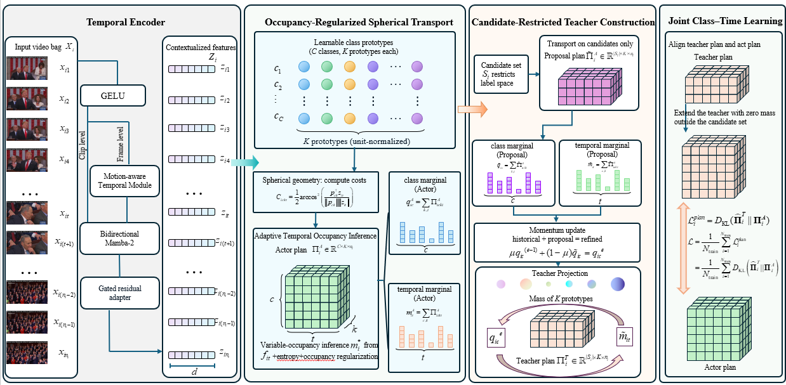

PIVOTMIPL: *Plan Inference via Variable-Occupancy Transport for Multi-Instance Partial-Label learning*
The algorithm frame work is shown in the figure below:

The structure of PIVOTMIPL project is
```text
PIVOTMIPL/
├── main.py          # 训练与评估入口
├── model.py         # PIVOTMIPL 模型与训练目标
├── dataloader.py    # MAT 数据读取、数据集及候选标签更新
├── utils.py         # 参数解析、特征类型识别与随机种子
├── environment.yaml # python环境
└── sbatch/          # 正式实验的 Slurm 启动脚本，共 12 个
    ├── breakfast_dinov3.sbatch
    ├── breakfast_mae.sbatch
    ├── breakfast_resnet.sbatch
    ├── breakfast_slowfast.sbatch
    ├── dota_dinov3.sbatch
    ├── dota_mae.sbatch
    ├── dota_resnet.sbatch
    ├── dota_slowfast.sbatch
    ├── fineaction_dinov3.sbatch
    ├── fineaction_mae.sbatch
    ├── fineaction_resnet.sbatch
    └── fineaction_slowfast.sbatch
```

PIVOTMIPL is implemented in PyTorch and requires an NVIDIA GPU because the temporal encoder uses the CUDA implementation of Mamba-2. We recommend creating the provided Conda environment first:

```bash
conda env create -f environment.yml
conda activate mipl
```

The provided environment.yml uses Python 3.10 and CUDA 12.4 development libraries.
PyTorch and Mamba are not pinned in the environment file and therefore need to be installed separately:
```bash
# Install PyTorch with CUDA 12.4 support
pip install torch --index-url https://download.pytorch.org/whl/cu124

# Install required Python packages
pip install numpy scipy h5py einops

# Install Mamba-2
pip install causal-conv1d --no-build-isolation
pip install mamba-ssm --no-build-isolation
```

## Running Experiments

We provide Slurm scripts for all 12 dataset–feature configurations in the
`sbatch/` directory. Each script contains the complete experimental
configuration, including dataset paths, feature dimensions, number of classes,
hyperparameters, and output directory.

To run an experiment, simply submit the corresponding script with `sbatch`.

The available configurations are:

Breakfast-MIPL
```
sbatch sbatch/breakfast_dinov3.sbatch
sbatch sbatch/breakfast_mae.sbatch
sbatch sbatch/breakfast_resnet.sbatch
sbatch sbatch/breakfast_slowfast.sbatch
```
DoTA-MIPL
```
sbatch sbatch/dota_dinov3.sbatch
sbatch sbatch/dota_mae.sbatch
sbatch sbatch/dota_resnet.sbatch
sbatch sbatch/dota_slowfast.sbatch
```
FineAction-MIPL
```
sbatch sbatch/fineaction_dinov3.sbatch
sbatch sbatch/fineaction_mae.sbatch
sbatch sbatch/fineaction_resnet.sbatch
sbatch sbatch/fineaction_slowfast.sbatch
```
